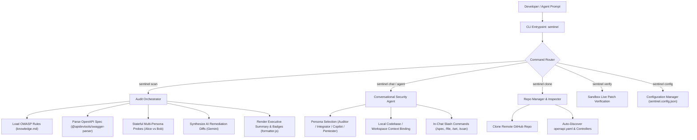

# SentinelAPI CLI Agent Playbook & Integration Guide

`sentinel-agent` is an autonomous terminal API security auditor, patch synthesizer, and conversational security copilot. It allows developers and autonomous AI agents to discover, audit, remediate, and verify OWASP API Security Top 10 vulnerabilities across local codebases and remote endpoints.

---

## 🏗️ Architecture & Component Flow



---

## ⚡ 1. Installation & Environment Integration

### Option A: Direct Repository Invocation (Recommended for Pair Programming)
No global permissions needed:
```bash
# Run from repository root
npm run cli -- <command>

# Or direct node execution
node cli/bin/sentinel.js <command>
```

### Option B: Global Binary Linking
Link `sentinel` into your system path:
```bash
cd cli
npm install
npm link # If permission error occurs, use: sudo npm link
```

### Option C: Environment Setup
To enable live Gemini AI synthesis, export your API key (or let Sentinel fall back to built-in offline heuristic patch engines):
```bash
export GEMINI_API_KEY="your-google-gemini-api-key"
```

---

## 🔄 2. End-to-End Execution Lifecycle

### Step 1: Configuration Initialization
Initialize or inspect project configuration defaults:
```bash
# Initialize sample configuration in workspace root
sentinel config init

# Inspect active configuration
sentinel config show

# Set custom target URL or default agent persona
sentinel config set target http://localhost:4000
sentinel config set defaultAgent secure_integrator
```

### Step 2: Codebase & Specification Discovery
Clone a remote repository or inspect a local workspace:
```bash
# Clone remote repo into .sentinel/repos and discover routes/specs
sentinel clone https://github.com/org/payment-service

# Inspect local workspace
sentinel clone ./ --json
```

### Step 3: Run Automated OWASP Security Audit
Execute autonomous multi-persona stateful probes:
```bash
# Run in interactive triage mode (Default in TTY)
sentinel scan

# Run automated scan for CI/CD pipelines (exits with 1 on high/critical)
sentinel scan --no-interactive --target http://localhost:4000 --spec ./sandbox-api/openapi.yaml --fail-on high

# Export raw JSON audit report for downstream processing
sentinel scan --json --fail-on none > audit-report.json
```

### Step 4: AI Patch Synthesis & Code Remediation
Generate surgical, production-ready Unified Git Diffs:
```bash
# Generate patch for specific finding
sentinel remediate --patch-id bola-orders

# Output raw JSON diff structure
sentinel remediate --patch-id bola-orders --json
```

### Step 5: Live Sandbox Patch Verification
Apply the patch against the running sandbox target and verify authorization enforcement:
```bash
# Apply patch and test
sentinel verify bola-orders

# Revert patch back to vulnerable baseline
sentinel verify bola-orders --revert
```

### Step 6: Pair Programming with Specialized AI Personas
Launch the conversational coding agent:
```bash
# Launch interactive chat session
sentinel chat --agent owasp_auditor

# Or choose specific persona
sentinel chat --agent secure_integrator
sentinel chat --agent remediation_copilot
sentinel chat --agent pentester
```

---

## 💬 3. In-Chat Interactive Slash Commands

When inside `sentinel chat`, the user or agent can issue special commands without leaving the terminal:

| Slash Command | Description | Example |
| :--- | :--- | :--- |
| `/agent [name]` | Switch active persona on the fly | `/agent secure_integrator` |
| `/repo <url\|path>` | Clone a remote repo or attach workspace | `/repo https://github.com/org/api` |
| `/file <relPath>` | Load a source code file into agent memory | `/file src/routes/users.js` |
| `/spec [path]` | Parse and bind OpenAPI schema to context | `/spec ./sandbox-api/openapi.yaml` |
| `/config` | Print active `sentinel.config.json` | `/config` |
| `/set <key> <val>` | Update config setting live while chatting | `/set target http://localhost:8080` |
| `/scan` | Execute live OWASP probes against target API | `/scan` |
| `/clear` | Reset conversation memory | `/clear` |
| `/export` | Export chat transcript to Markdown | `/export` |
| `/help` | Show command cheat sheet | `/help` |
| `/exit` | Exit chat session | `/exit` |

---

## 🤖 4. Agent Personas Reference

1. 🛡️ **`owasp_auditor` (OWASP Top 10 Security Auditor)**
   - **Focus**: Detects and dissects BOLA, Broken Authentication, Sensitive Property Exposure, Rate Limiting, SSRF, and BFLA.
   - **When to use**: To audit endpoint schemas, analyze vulnerability root causes, and check OWASP compliance.

2. 🔒 **`secure_integrator` (Secure API Integration Specialist)**
   - **Focus**: Zero-trust client/server integrations, HMAC request signing, token lifecycle (JWT / HttpOnly cookies), and runtime schema validation (Zod/Joi).
   - **When to use**: When writing API consumption code, middleware guards, or frontend API clients.

3. 🔧 **`remediation_copilot` (Live Code Remediation & Patch Copilot)**
   - **Focus**: Generates surgical Unified Git Diffs (`--- a/... +++ b/...`) that preserve backwards compatibility and fix security flaws.
   - **When to use**: When fixing flagged vulnerabilities and applying patches.

4. ⚡ **`pentester` (API Penetration Testing & Exploit Agent)**
   - **Focus**: Stateful adversary simulations, token tampering payloads, and reproducible cURL PoCs.
   - **When to use**: To test API resilience and verify that exploit vectors are neutralized.

---

## 🧪 5. Testing & Verification

Run the full integration test suite across all modules:
```bash
npm --prefix cli test
```

### Verified Test Cases:
- ✅ `sentinel --help` command registry check
- ✅ `sentinel scan` audit execution & schema parsing
- ✅ `sentinel scan --fail-on` exit code threshold check
- ✅ `sentinel remediate` Unified Git Diff patch generation
- ✅ `sentinel verify` Sandbox patch live toggling
- ✅ `sentinel clone` local workspace auto-discovery
- ✅ Agent personas & offline fallback generation
- ✅ `sentinel config show` & `sentinel config set` configuration updates
